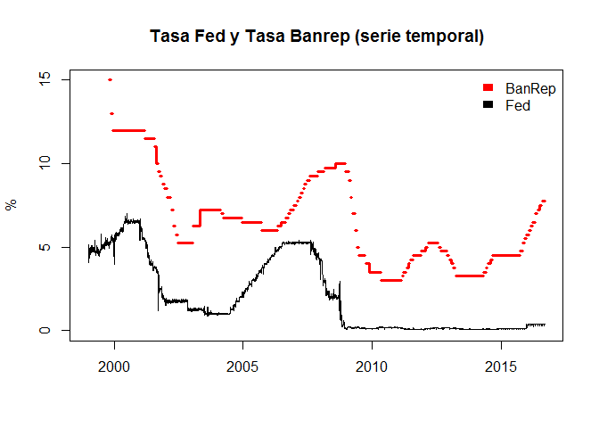

Análisis de la tasa de cambio en Colombia
================
Norman Simón Rodríguez
Versión 12 de septiembre de 2016

Estadística descriptiva
=======================

Tasa de interés de la Reserva Federal de Estados Unidos.
--------------------------------------------------------

Vamos a analizar los datos de la tasa de interés de los Fed Funds de la Reserva Federal de Estados Unidos. Los datos fueron directamente descargados de la [página de la Reserva Federal](https://www.federalreserve.gov/releases/h15/data.htm#fn1). Datos mensuales (promedios).

Si graficamos la tasa de interés de la Fed contra el tiempo (datos diarios desde agosto de 1954), podemos ver una marcada tendencia a las altas tasas alrededor de 1980, y unas tasas notablemente bajas desde finales de la década del 2000 (correspondientes al periodo del QE o relajamiento cuantitativo):

Haciendo zoom en el periodo que viene desde la década de 1990 vemos más claramente el periodo del QE: 

Tasa de cambio
--------------

Ahora vamos a analizar la tasa de cambio de pesos colombianos por dólar. Los datos son del [aplicativo SeranKUA del Banco de la República](http://www.banrep.gov.co/es/trm) y son diarios.

Desde mediados de los 80 ha habido un incremento sostenido en la tasa de cambio, con picos hacia fines de los 90 y en la actualidad (hubo un descenso sostenido en la tasa de cambio en la década de los 2000). Estos cambios abruptos y persistentes en el tiempo son potencialmente interpretables como transiciones de fase: 

La tasa de cambio en Colombia fue fija hasta 1991 (las variaciones de la tasa antes del 91 responden a devaluaciones intencionales para mantener los términos de intercambio, ya que la inflación colombiana era mayor que la estadounidense).

La tasa de interés en Colombia
------------------------------

La tasa de cambio también depende, en teoría, de la tasa de interés interna de Colombia, para la cual también tomamos información. Los datos fueron tomados del [aplicativo SeranKUA del Banco de la República](http://www.banrep.gov.co/es/tasa-intervencion-politica-monetaria) y corresponden a la tasa de intervención del Banco de la República.

Vemos que desde el 99 la tasa de intervención del Banco de la República se ha mantenido en un nivel bajo, posiblemente gracias al esquema de tasa de cambio flotante que se adoptó plenamente en ese año.

Cruces de datos
===============

Haremos un cruce de datos sencillo para las series de tiempo desde inicios de 1999.

Si cruzamos la tasa de interés de la FED con los datos de la tasa de cambio no encontramos relación aparente:

Haciendo el cruce con la tasa de interés de intervención del Banco de la República la situación es poco esclarecedora:

 No obstante, si tenemos en cuenta que la política del Banco de la República es reactiva (reacciona a los cambios en la tasa de interés), valdría la pena evaluar estas mismas variables en relación con el tiempo:

Como se puede observar, hay una aparente relación inversa entre la tasa de interés y la TRM, tal como cabría esperar. De hecho, cuando mayor es la tasa de interés, menor la tasa de cambio, lo que se explica porque cuando la tasa de interés es alta, se reduce la cantidad de dinero en la economía, lo que lleva a que los pesos se encarezcan frente al dólar (es decir, a que cada dólar valga menos pesos).

Al hacer el mismo ejercicio con la tasa de interés de Estados Unidos la relación es también marcada, al menos hasta el 2008. De ahí en adelante la tasa de interés de la FED se mantuvo constante en cero y la tasa de cambio empezó a variar por su cuenta movida por variables macroeconómicas diferentes a la tasa de la Fed:

Como vemos, la tasa de cambio depende fuertemente de las decisiones del banco central de Estados Unidos, y la labor del Banco de la República es más bien reactiva (la tasa del BanRep simplemente le sigue la pista a la tasa de la Reserva Federal y eso se debe a que la inflación en Colombia depende mucho del precio del dólar). En efecto, si la Fed sube sus tasas, hay menos dólares en la economía mundial, lo que hace que la TRM suba. Al subir la TRM, los bienes importados se encarecen, generando inflación. Para reducir la inflación, el Banco de la República de Colombia debe incrementar sus propias tasas de interés y así reducir la cantidad de dinero en la economía. Esta correlación entre las tasas de interés de los dos países es evidente en la siguiente gráfica:

